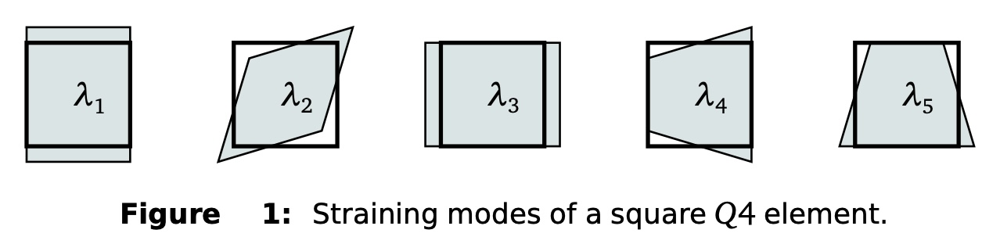

# Topology optimization process 

In the current project we want to solve the topology optimisatopn problem for mechanical structures. The reference [paper](https://www.degruyter.com/document/doi/10.1515/rnam-2019-0018/html) by Ivan Sosnovik and  Ivan Oseledets. Our pipeline for solving the problem: comparison of traditional methods of topological optimization and methods based on machine learning, attempts to combine these methods.

## Minimum complience: problem statement 

The real minimum compliance problem is a distributed, descrete valued design problem, which consists of calculating the complience (the inverse of stiffness) for each possible permutation of the design domain. Thus, if we discretise a 2D domain into X-by-Y mesh of finite elements, and knowing that each element has two possible values (0 and 1), we have $2^{X\times Y}$ possible permutations of the domain. This is extremely expensive to compute: for a small 4-by-4 domain, we have to calculate $2^{4\times 4} = 65536$ possible material designs and evaluate each one in order to find the design's compliance, with each requiring a finite element analysis (FEA). The problem is further compounded in that each FEA becomes computationally more expensive as the domain discretation is increased. 

The above mentioned problem can be solved using, for example, the SIMP method [2]. Basically, the approach is to replace the discrete variables with continuous variables and then to introduce some form of penalty that will drive the solution to discrete solid-void-values. The element stiffness matrix is then modified so that it becomes a function of the continuous variables, where the latter are now the design variables. The continuous design variables could be interpreted as the density of the material. 

Then let's rewrite the general form of a mathematical optimization problem as a minimum compliance topology optimization problem. The SIMP problem for minimum complience is $$min_{x}f(x) = q^{T}r = \Sigma_{i=1}^n (x_{i})^{p}q_{i}^{T}K_{i}q_{i},$$ $$s.t.\hspace{2 mm} g_{j}(x) \le 0, j = 1,2,...,m,$$ $$Kq = r,$$ $$0 \le x_{i_{lower}} \le x_{i} \le 1, i = 1,2,...,n.$$ The objective function $f(x)$ represents complience or strain energy, $x_{i}$ represents the design variable, that is a finite element. Thus, $(x_{i})^{p}$ represents the penalised design variable (or density) and $p$ is the SIMP penalty parameter. Using of a lower bound $x_{i_{lower}}$ on the density is due to prevent any possible singularity of the equilibrium problem. The $q$ represents the finite element global displacement vector, $q_{i}$ represents the elemental displacement vector, $r$ is the global load vector, $K_{i}$ is the element stiffness matrix and $K$ is the global assembled finite element stiffness matrix. The $m$ linear constraints are represented by $g_{j}(x)$ and the last equation represents the side constraints on $x_{i}$. Subscript $i$ indicates elemental quantities and operators, $q_{i}$ refers to the displacement contribution of element $i$. 

Further we consider only $n$ equally sized finite elements in the finite element mesh, with the corresponding vector of design variables $x = [x_{1}, x_{2}, ... , x_{n}]^{T}$. It is assumed that the load vector, $r$, is independent of the design variables $x$, that is $r\neq f(x)$. 

Then to obtain standart minimum complience problem with single constraint, we set $m=1$ and formulate the constraint: $$g(x) = \frac{v(x)}{v_{0}} - v_{lim} = \frac{1}{v_{0}}\Sigma_{i=1}^{n} v_{i}x_{i} - v_{lim} \le 0,$$ where $v(x) = v$ represents the final $area\times 1$ in the 2D domain occupying the design domain, $v_{0}$ is the total area of the design domain, $v_{lim}$ is the prescribed limit on the final area fraction, and $v_{i}$ is the area that each element takes. When the finite elements are all equally sized, $v_{i}$ is the same for each element and can therefore be moved in front of summation symbol and be replaced by $v_{e}$. $K_{i}$ is also the same for each element, and is replaced by $K_{e}$. Finally, we can write the above problem as: $$min_{x}f(x) = \Sigma_{i=1}^{n} (x_{i})^{p}q_{i}^{T}K_{e}q_{i},$$ $$s.t.\hspace{2 mm} g(x) = \frac{v_{e}}{v_{0}}\Sigma_{i=1}^{n} x_{i} - v_{lim} \le 0,$$ $$Kq = r,$$ $$0 \le x_{i_{lower}} \le x_{i} \le 1, i = 1,2,...,n.$$


## Finite elements with penalised equilibrium

Assumed stress hybrid elements are renowned for their accurate stress solution, due to the fact that the stress and displacement trial functions are selected independently. For a 2D 4-node quadrilateral (Q4) membrane element, the displacements $u$ are typically interpolated as $$u=Nq,$$ with $N$ the bi-linear Lagrangian interpolation functions, and $q$ is the unknown elemental nodal displacements. The stress $\sigma$ is interpolated as $$\sigma = TP\beta,$$ where $P$ is the stress interpolation matrix, $T$ is an optional transformation or constraint matrix, and $\beta$ is the unknown elemental stress psrsmeters. Selecting $T$ and $P$ is not straight forward - there are no unique optimal formulations. Typically, 5 $\beta$ parameters are used with : $$P = \begin{pmatrix} 1 & 0 & 0 & ƞ & 0 \\ 0 & 1 & 0 & 0 & ξ \\ 0 & 0 & 1 & 0 & 0\end{pmatrix},$$ where ξ and ƞ are the natural coordinates. 

Accurate  stress solutions in the sense of the energy norm do not necessarily imply pointwise accurate stress predictions within elements [3]. Most hybrid elements only yield accurate stress predictions at the element centrid, while stress predictions at element edges and in particular element nodes, can be highly inaccurate. To improve the accuracy of point wise predictions in hybrid elements, a number of formulations have been proposed. This includes pre- and post-treatment proposed by authors of the paper [3], with post-treatment simpler and superior.

While distributed body forces may induce important loads on a structure, they can usually be ignored on the element level in stress calculations. Thus, element equilibrium could be written as: $$\partial\sigma = D^{T}\sigma = 0\hspace{2 mm} in \hspace{2 mm}\Omega,$$ where $D$ is the 2D differential operator and $\Sigma$ is the element domain. Enforcement of the equation above in the cariational formulation yields a functional: $$Π^{*}(u,\sigma) = Π(u,\sigma) - \alpha\int (\partial\sigma)^{T}(\partial\sigma)\,d\Omega,$$ where $\alpha >> 0$, $Π(u,\sigma)$ represents the potential of the Hellinger-Reissner principle. Using matrix notation, and for the sake of convergence setting $\alpha \leftarrow \alpha/2E$, the potential of the assumed stress elements becomes: $$Π^{*}(u,\sigma) = \beta^{T}Gq - \frac{1}{2}\beta^{T}(H+\frac{\alpha}{E}H_{p})\beta- q^{T}r$$ with $$G = \int_{\Omega} P^{T}B\, d\Omega,$$ $$H = \int_{\Omega}P^{T}C^{-1}P\,d\Omega,$$ $$r = \int_{\Omega}N^{T}f\,d\Omega,$$ and $$H_{p} = \int_{\Omega}(\partial P)^{T}(\partial P)\,d\Omega,$$ where $P$ is now understood to represent the matrix product $TP$. From the stationary condition, the elemental stress parameters may be recovered as: $$\beta = (H+\frac{\alpha}{E}H_{p})^{-1}Gq,$$ while the force-displacement relationship is obtained as: $$G^{T}(H+\frac{\alpha}{E}H_{p})^{-1}Gq = r,$$ or $$Kq = r.$$

For elements of regular geometry, penalised equilibrium has no detrimental influence. However, for elements of irregular geometry, the stiffness associated with the higher order deformation modes completely vanishes as $\alpha \rightarrow ∞$. 

Let's now consider displacement based element. Even though the enforcement of $\partial \sigma = 0$ in $\Omega$ seems difficult for the Q4 element, it may be attempted to soften the higher order deformation modes by means of introducing elemental parameters, expressed in terms of the element equilibrium equations. 

The straining or deformation modes of square Q4 element are shown in Figure 1. The higher order modes are to be blamed for the poor perfomance of this element in bending. For the element, the stresses are obtained from: $$\sigma = Cε = CBq$$ Hence $$\partial \sigma = \partial (CBq) = \overline{B}q$$ The potential energy is constructed then as follow: $$\Pi^{*}(u) = \frac{1}{2}q^{T}\int_{\Omega}B^{T}CB\,d\Omega q - \alpha q^{T}\int_{\Omega}\overline{B}^{T}\overline{B}\,d\Omega q - q^{T}r.$$ The force-displacement relationship for new Q4(\alpha^{*}) element, that is $Q4\alpha 5 \beta$, is then obtained as: $$(K-\alpha E\overline{K})q = r,$$ where $\alpha \leftarrow \alpha E/2.$ In compare with the normal force-displacement relationship for the Q4 element, $Kq=r$, the difference is the introduction of $\alpha E \overline{K},$ which is introduced in order to soften higher order modes of the Q4 element. 



## Topology optimization

In the current project we want to solve the topology optimisatopn problem for mechanical structures, considering a design domain $Ω$ filled with a linear isotropic elastic material and discretized with square finite elements. The material distribution is described by the binary density variable xj that represents either absence (0) or presence (1) of the material at each point of the design domain. Therefore, the problem has a form almost the same as the problem statement of the minimum complience: $$min_{x}f(x) = \Sigma_{i=1}^{n} E_{i}(x_{i})q_{i}^{T}K_{e}q_{i},$$ $$s.t.\hspace{2 mm} g(x) = \frac{v_{e}}{v_{0}}\Sigma_{i=1}^{n} x_{i} - v_{lim} \le 0,$$ $$Kq = r,$$ $$0 \le x_{i_{lower}} \le x_{i} \le 1, i = 1,2,...,n.$$ As we have already mentoined the problem is computationally expensive due to its discrete nature. And for solving this issue so-called SIMP algorithm is used. It allows to achive the non-binary solutions by choosing Young's modulus of a simple but very efficient form: $$E_{i}(x_{i}) = E_{min} + x^{p}_{i} (E_{0} − E_{min}),$$ where $p$ is some form of penalty that will drive the solution to discrete solid-void-values. Then discrete design variables is replaced with continious design variables which could be interpreted as the density of the material.

## Neural Network for Topology Optimization

We use [TOP dataset](https://github.com/ISosnovik/top) to train the model.
The dataset of topology optimization process. It contains the precise solutions of 10,000 randomly stated problems. Each object is a tensor of shape `(100, 40, 40)`: 100 iterations, `40×40` grid.

In order to optain .h5 file: ```python prepare_data.py --source TOP4040 --dataset-path ./output_dataset.h5 ```

To start training the network you need to run: ```python training_torch.py --dataset-path output_dataset.h5```

In our topology optimization process, it is possible to leverage an already trained unet NN. To implement this, refer to the methods demonstrated in methods_results.ipynb.

## Some of the key methods identified are:

optimization_step: updating the design variables and computing changes.

optimization: This function executes optimization iterations and saves history.

implement_solution: This method is designed to reapply a solution.

get_history: This function returns the history of previous iterations.

postprocess_history_: This method for post-processing the results of the optimization process.

